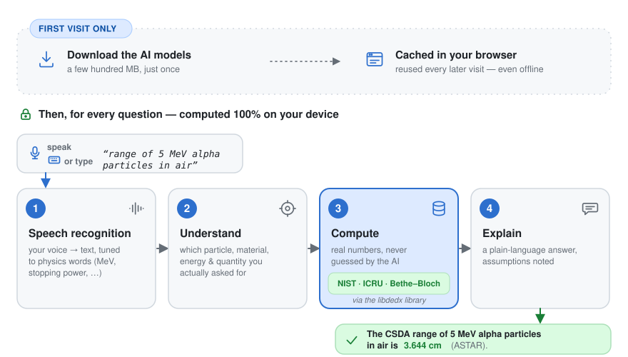
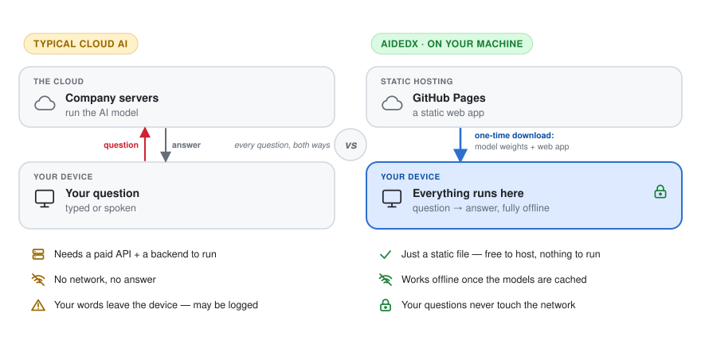

# aidedx

**Ask about the range, kinetic energy, or stopping power of protons and heavy ions — just speak or
type the question in plain language and get a real answer, computed entirely on your own machine.**

Questions like _"how far does a 5 MeV alpha particle go in air?"_ or _"what's the stopping power of
200 MeV/nucl carbon ions in water?"_ normally mean digging through a form or a data table. aidedx
lets you simply ask:

> 🎤 _"What is the range of 40 MeV protons in PMMA?"_
>
> → _"The CSDA range of 40 MeV protons in PMMA is 1.285 cm (PSTAR)."_

The key point: **the answer comes from trusted reference data — NIST (PSTAR/ASTAR), ICRU, and
Bethe–Bloch calculations — not from an AI making numbers up.** The AI only listens to your question
and works out what you're asking; the physics is then computed (via the
[libdedx](https://github.com/APTG/libdedx) library). It's a **free web app** — no registration, no
install, nothing you type or say ever leaves your device.

## How to use it

1. **Open the app** at <https://aptg.github.io/aidedx/> — nothing to install.
2. **Allow the one-time download** when prompted. aidedx fetches its AI models (a few hundred MB) and
   caches them in your browser, so this happens only on your first visit.
3. **Ask your question** — press 🎤 and speak, or type it. For example: _"stopping power of 150 MeV
   protons in water"_.
4. **Read the answer.** Any assumptions aidedx made (isotope, energy interpretation, program) are
   noted alongside it.

It's just a web app: no repo to clone, no app to install, no login needed.

## How it works

aidedx runs in two phases. The **first time** you visit, it downloads its AI models once and caches
them in your browser. **After that**, every question is handled entirely on your machine, in four
steps that each feed the next — speech/text in, then:

  <picture>
    <source
      media="(prefers-color-scheme: dark)"
      srcset="docs/assets/pipeline-dark.svg"
    />
    
  </picture>

Speech recognition is tuned to physics vocabulary rather than everyday speech, and retries if a
decode ever fails outright. See the [technical documentation](docs/development.md) for the
specifics.

## Why "on your machine" matters

Most AI tools send your words to a company's servers. aidedx does the opposite — the models run
**locally, in your browser**:

  <picture>
    <source
      media="(prefers-color-scheme: dark)"
      srcset="docs/assets/local-vs-cloud-dark.svg"
    />
    
  </picture>

The only trade-off is that one-time download — fetching the AI's "brain" the first time you use it.
After that, it works offline too, handy in an experiment hall or anywhere with no signal.

## Project status

Early-stage prototype under active development:

- ✅ **Works:** typed or spoken question → understood → computed → answered, with any assumptions
  aidedx made shown clearly so you can correct them by hand; the one-time model download asks first
  and shows a progress panel; answers link out to [dedx_web](https://github.com/APTG/dedx_web) for
  full plots.
- 🚧 **In progress:** Polish-language support ([#63](https://github.com/APTG/aidedx/issues/63)) — the
  language understanding and a Polish voice pipeline exist behind the scenes, but you can't yet switch
  the app itself into Polish; smarter correction for phrasings the built-in rules miss.
- 🐢 **Slow / open:** on a computer without a dedicated graphics card, answers can take a few seconds
  instead of feeling instant — faster hosting options are still being worked out
  ([#64](https://github.com/APTG/aidedx/issues/64)).
- 🔭 **Planned:** spoken answers, wider phrasing coverage, and apps beyond the browser — an Android
  app is being scoped first ([#120](https://github.com/APTG/aidedx/issues/120)), with an installable
  app for other phones/computers (no app-store download needed) or a full desktop app to follow,
  reusing the same on-device technology.

## Documentation & resources

- 📖 **[User guide](docs/user-guide.md)** — _coming soon._
- 🛠 **[Technical documentation](docs/development.md)** — stack, dev workflow, internals, and pointers to every deep-dive doc.
- 🧮 **[APTG/libdedx](https://github.com/APTG/libdedx)** — the library computing every number, built on NIST [PSTAR](https://physics.nist.gov/PhysRefData/Star/Text/PSTAR.html)/[ASTAR](https://physics.nist.gov/PhysRefData/Star/Text/ASTAR.html) and ICRU data.
- 🌐 **[APTG/dedx_web](https://github.com/APTG/dedx_web)** — the form-driven web tool aidedx complements and reuses.

## License

**GPL-3.0-or-later** ([`LICENSE`](LICENSE)) — see [third-party licenses](docs/development.md#third-party-licenses).

---

Happily vibe-coded with Claude by [grzanka](https://github.com/grzanka).
